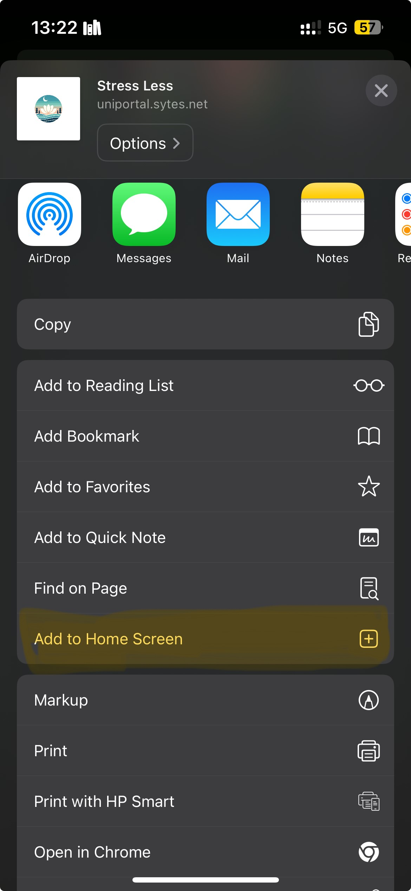

# Stress Less

Stress Less is a web application designed to help you reduce stress through interactive activities. The application provides a fun and engaging way to take a break and unwind.

## Features

- **Red Button**: Press the red button to receive a random action.
- **Three Random Actions**:
  - **Tetris**: Play the classic Tetris game.
  - **Memory Game**: Match pairs of cards to win.
  - **Breathing Exercise**: Follow a guided breathing exercise with a rhythm of 4 seconds inhaling, 2 seconds holding, 4 seconds exhaling, and 20 seconds resting.

## GIF Demonstrations

  

    <h3>How to Save to Home Screen</h3>
    
Save the app to your home screen for a better display experience.

    
  

  

    <h3>Gameplay for the Three Exercises</h3>
    
Check out the gameplay for the three different exercises.

    
  

## Technologies Used

- **Frontend**: React
- **Backend**: Node.js

## About

This project was developed as part of the course "Digital Health Technologies" at the National Technical University of Athens.
